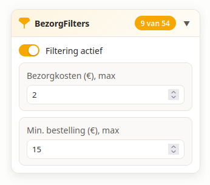

# BezorgFilters (Firefox add-on)

Licensed under the [MIT License](./LICENSE).



A Firefox add-on that adds price-based filters to
[thuisbezorgd.nl](https://www.thuisbezorgd.nl) that the site itself does not offer:

- **Delivery fee** (maximum, in euros; enter `0` for free delivery only)
- **Minimum order amount** (maximum, in euros)

An empty field means "no filter". Non-matching restaurants are **dimmed** (kept visible
but greyed out), and the filter state persists across sessions. Dimming keeps the page
layout intact, including for lazily loaded cards. The panel and popup follow the site's
light/dark theme via `prefers-color-scheme`.

The name "BezorgFilters" and its branding are deliberately independent of any food
delivery platform; the add-on is an unofficial enhancement and is not affiliated with
or endorsed by any such platform.

## How it works

- A content script runs on the listing pages, observes the DOM with a
  `MutationObserver` (the list is rendered client-side and updates as you scroll/filter),
  extracts each restaurant card's delivery fee and minimum order amount, and dims
  non-matching cards.
- A collapsible filter panel is injected as a new section for quick access, styled
  distinctly so it is clearly from the extension. Exactly one panel exists at any
  time and it relocates with the page layout:
  - Desktop: inside the site's filter sidebar (`ul[data-qa="filter"]`).
  - Mobile: directly below the cuisine row (always visible, no clicks needed), or
    inside the filters sheet that opens from the filter button in the shortcuts bar.
  - The panel re-evaluates its mount point when the layout changes (resizing,
    breakpoint switches, modal open/close) and never duplicates.
- A toolbar popup offers the same settings and works on any page.
- Settings are stored via `browser.storage.local` and stay in sync between the panel
  and the popup.

> **Note on selectors:** the site's frontend changes frequently. The card/fee
> selectors are defined at the top of `content.js` and are intentionally kept in one
> place so they are easy to update when the site changes. The current selectors are
> based on the site's `data-qa` attributes (`restaurant-card`,
> `restaurant-delivery-fee`, `restaurant-mov`, `restaurant-info-name`) and are
> verified by the DOM integration test against a captured listing page fixture.

## Project layout

```
manifest.json          Add-on manifest (MV3, Firefox)
content.js             Content script: card discovery, filtering, injected panel
content.css            Styles for the injected panel and dimmed cards
lib/filters.js         Shared filter logic (pure, unit-tested)
popup.html/.js/.css    Toolbar popup
icons/                 Add-on icons (generated by tools/make_icons.py)
docs/                  Store listing assets (screenshot, AMO description)
tools/                 Icon generation script (dev-only, excluded from builds)
test/                  Node tests (jsdom integration + unit)
```

## Development

The manifest declares `browser_specific_settings.gecko_android`, so AMO
lists the add-on as compatible with both Firefox (desktop) and Firefox for
Android (both from 142.0). Without that key, AMO marks a version as
desktop-only regardless of any listing toggle.

No build step and no runtime dependencies. Load the add-on directly:

1. Open Firefox and go to `about:debugging#/runtime/this-firefox`
2. Click **Load Temporary Add-on…**
3. Pick `manifest.json` in this repository

### Automatic version tags

Every push to `main` (i.e. every merge) triggers the **Tag version** workflow
(`.github/workflows/tag-version.yml`), which computes the same GitVersion-derived
version as the release lanes and tags the merge commit `v<version>`. The tag
becomes the new GitVersion version source, so each subsequent merge derives
exactly one fresh patch version. Tags that point at a different commit are
never overwritten — a collision fails the run instead.

### Tests

```bash
npm install
npm test
```

Runs the unit tests for price parsing and filter matching, a jsdom-based DOM
integration test (extraction + dim behavior against a captured listing-page
fixture), and a manifest/asset check.

### Packaging

Zip the repository contents (manifest at the zip root) or use
[web-ext](https://github.com/mozilla/web-ext):

```bash
npx web-ext build
```

CI (GitHub Actions) runs the tests and uploads a build artifact on every push.

### Releases (unlisted)

The **Release (unlisted)** workflow
(`.github/workflows/release.yml`) signs the add-on as an **unlisted** AMO
add-on and attaches the signed `.xpi` to a GitHub release. It is triggered
only by hand from the GitHub Actions tab (*Run workflow*); merging to
`main` never signs or releases anything.

It takes an optional `version` input (strict `major.minor.patch`); leave it
empty to derive the version from [GitVersion](https://gitversion.net) 6.x
(`GitVersion.yml`, base `0.1.1`) the same way CI historically did:
`<major>.<minor>.<patch + distance>` (commit distance since the version
source). Tag a commit (e.g. `v0.2.0`) to reset the base version. The workflow
then patches `manifest.json`, runs the tests, builds the zip, signs it via
`web-ext sign --channel unlisted`, and attaches the `.xpi` to a GitHub
release (`v<version>`).

This requires two repository secrets: `AMO_JWT_ISSUER` and `AMO_JWT_SECRET`
(your AMO API credentials). Install the signed `.xpi` from the release page via
*Install Add-on From File*, or link users to the release asset directly —
self-distributed add-ons do not auto-update unless an `update_url` is added
to the manifest.

### Publishing to the AMO store (listed)

A separate manual workflow, **Publish to AMO (listed)**
(`.github/workflows/publish-amo.yml`), submits the add-on to
[addons.mozilla.org](https://addons.mozilla.org) as a **listed** add-on. It is
also triggered only by hand; merging to `main` never publishes to the store.

It takes the same optional `version` input (empty = derive from GitVersion)
and optional `approval_notes` for the reviewers, then:

1. Resolves the version, patches `manifest.json`, and runs the tests,
2. Builds and lints the packaged add-on with `web-ext lint` (the same
   validator AMO runs),
3. Submits via `web-ext sign --channel listed --approval-timeout 0`, so the
   run finishes immediately after submission instead of waiting for review,
4. Attaches the **unsigned source zip** to a GitHub release (`v<version>`)
   for reference — AMO hosts the actual signed build, so this zip is not
   installable; it exists so every store submission has a downloadable
   copy in the repo. The workflow never signs unlisted.

Choosing between the two lanes:

- **Unlisted** gives you a signed `.xpi` you self-distribute (GitHub release,
  your own site). No review, no store listing, no auto-updates.
- **Listed** puts the add-on on the AMO store after review: AMO hosts and
  distributes it (auto-updates included).
- You can run both lanes for the same code, but **versions are unique per
  add-on across both channels**: AMO keeps one version namespace per add-on
  ID, so a version signed by one lane cannot be reused by the other —
  submitting an existing version fails with `409 Version already exists`.
  Never publish the same version on both channels; when both lanes would
  derive the same version from one commit, pass an explicit `version` to one
  of them so they stay distinct.
- **First listed submission only:** the workflow sends all metadata AMO
  requires for a new listing — name, summary (both derived from
  `manifest.json`), categories (`shopping` for Firefox and Android), and the
  MIT license. Only the store listing content that cannot be set via the
  API (screenshots, long description) is filled in by hand in the AMO
  developer dashboard afterwards. Subsequent submissions update the
  existing listing automatically.
- After a listed submission the version is *pending review* in the AMO
  dashboard; once approved, AMO hosts and distributes the add-on and no
  `.xpi` needs to be attached to a GitHub release.

## Limitations

- Only `www.thuisbezorgd.nl` is targeted (matches in `manifest.json`).
- Delivery fee and minimum order values are read from what the site renders; if the
  site changes its markup, selectors in `content.js` need updating.
- "Free delivery available" tags are treated as free delivery (fee 0).
- Cards with unreadable/missing fees are shown by default rather than hidden.
- Stored settings from older versions (hide mode, fee minimum, free-delivery toggle) are
  migrated automatically; a stored `0` fee from those versions is treated as "unset".
